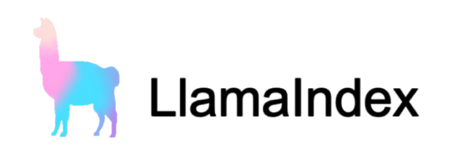
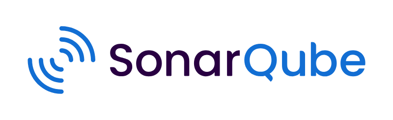
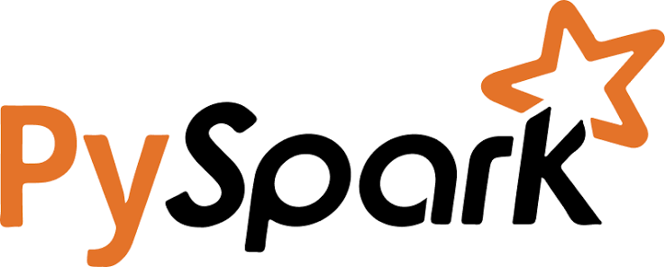
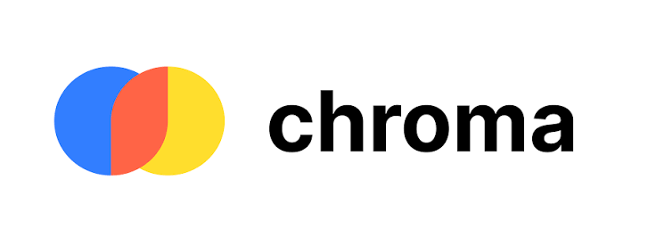
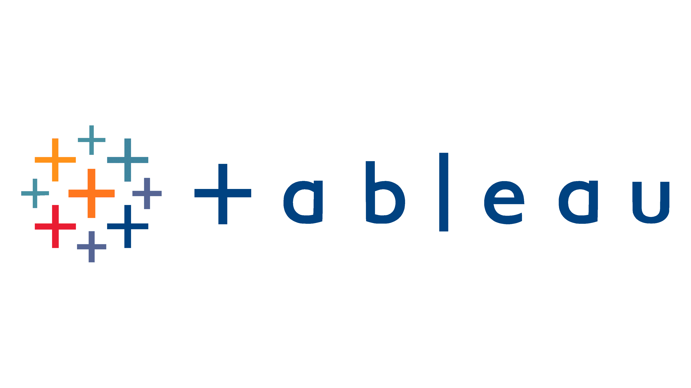

# Welcome to my GitHub!

Hi there and thank you for visiting me 👋! Nice to know you, I'm **Willy**. I have a Masters degree in Artificial Intelligence with a goal of building awesome, high-quality software applications. I'm always looking to grow professionally, whether working individually or as part of a team.

📖 I am hoping to learn something new / in-depth about:
<ol>
  <li>
    🤖 AI Engineering 
    
     
    
    
    
      
  </li>

  <li>
    👨‍💻 Full Stack Development 
    
     
    
    
    
    
    
     
    
     
    
    
    
    
      
  </li>
  <li>
    🛠️ DevSecOps & MLOps
     
     
    
    
     
    
     
    
    
    
    
    
    
      
  </li>
  <li>
    ☁️ Cloud Services
     
     
    
    
    
     
    
     
    
      
  </li>
  <li>
    ⚙️ Data Engineering
     
     
    
    
  </li>
</ol>
      
<table>
  <tbody>
    <tr>
      <td>
        <h3>🚀 Check out my portfolio website <a href="https://alexanderwilly.vercel.app/">here</a>!</h3>
      </td>
    </tr>
    <tr>
      <td>
        <h3>
          
          &nbsp;
          Let's 
          <a href="https://www.linkedin.com/in/alexanderwillyj/">
            connect
          </a>!
        </h3>
      </td>
    </tr>
    <tr>
      <td>
        <h3>
          
          &nbsp;
          Email me at: 
          <a href="mailto:alexanderwillyj@gmail.com">
            alexanderwillyj@gmail.com
          </a>!
        </h3>
      </td>
    </tr>
  </tbody>
</table>

(<a href="#readme-top">back to top</a>)

## My Tech Stack

### I primarily code in:

### But I have experience using:

<table>
  <thead>
    <tr>
      <th>Category</th>
      <th>Language / Framework / Tools</th>
    </tr>
  </thead>
  <tbody>
    <tr>
      <td><b>Frontend</b></td>
      <td>
        
        
        
        
        
        
      </td>
    </tr>
    <tr>
      <td><b>Backend</b></td>
      <td>
        
        
        
        
        
        
      </td>
    </tr>
    <tr>
      <td><b>AI Frameworks</b></td>
      <td>
        
        
        
        
        
        
      </td>
    </tr>
    <tr>
      <td><b>Databases</b></td>
      <td>
        
        
        
        
      </td>
    </tr>
    <tr>
      <td><b>Cloud Platforms</b></td>
      <td>
        
        
        
        
        
      </td>
    </tr>
    <tr>
      <td><b>Data Engineering</b></td>
      <td>
        
        
      </td>
    </tr>
    <tr>
      <td><b>Data Analytics</b></td>
      <td>
        
      </td>
    </tr>
    <tr>
      <td><b>Project Management</b></td>
      <td>
        
        
      </td>
    </tr>
    
  </tbody>
</table>